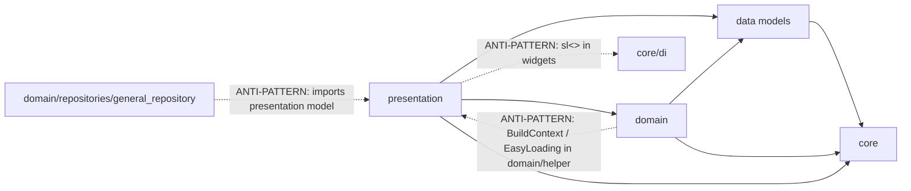

# Architecture Map (as implemented)

This document describes the architecture that **exists**, not the one we wish existed. Deviations from the universal standard are marked and linked to ADRs.

## 1. Layer layout

```text
lib/
├── main.dart                         runZonedGuarded → AppInitializer.init → runApp(MyApp)
├── firebase_options.dart
├── generated/json/                   FlutterJsonBeanFactory output (LEGACY serializer)
└── layers/
    ├── app/        app.dart barrel, initializer/, custom/CountryCodePicker (vendored pkg)
    ├── base/       BaseCubit, Status, BaseResponsiveView, GlobalVariable, MainConfig
    ├── core/       config, di, network, navigation, realtime, notification, storage,
    │               auth, theme, services, deepLink, lifeCycle, widgets
    ├── data/       models/{requestModels,responseModels,chatModels,...}, remote/,
    │               localDB/, localModels/, repositoryImpl/, globalUpdatesHandler/, helper/
    ├── domain/     repositories/ (abstract), usecases/chatMessageList, services/, policies/,
    │               controller/, helper/, realtime/
    ├── presentation/ bloc/ (14), cubit/ (~68), ui/<feature>/{widgets,model,...},
    │               commonWidgets/, shared/, auth/
    └── utils/      exports.dart (mega-barrel), extensions, DebugLog, encryption
```

Architecture level (see `sop/architecture.md`): **Level 3 — Layered / Modular**, layer-first orientation (ADR-0001).

## 2. Layer dependency rules (observed vs intended)



Intended direction: `presentation → domain → data → core`. `core` depends on nothing above it. The three dashed edges are violations tracked in `remediation-backlog.md`.

## 3. Composition root

`core/di/service_locator.dart` registers in this fixed order (order is load-bearing; comments in the file say so):

1. `ConfigInjection` — reads `String.fromEnvironment` values into `AppConfiguration`
2. `GlobalEventBus` (lazy singleton, disposed)
3. `AppLifeCycleHandler`, `MainConfig`
4. `ExternalDependency` — Dio, GetStorage, FirebaseMessaging, InternetConnection, etc.
5. `HiveInjection` — boxes + adapters
6. `AppLevelInjection` — `AuthStateProvider`, `AppStorage`, `NetworkMonitor`, `NavigationService`, socket, notifications
7. `DataSourceInjection`
8. `RepositoryInjection` — `registerLazySingleton<Abstract>(() => Impl(dep: sl()))`
9. `DomainServicesInjection`
10. `BlocsInjection`, `CubitsInjection` — `registerFactory`
11. `BootStartupInjection` — `AppBootStartup`

Resolution points that are **allowed** (composition roots): the DI modules above, `BlocProvider(create: (_) => sl<X>())` in `main.dart`, `AutoRouteWrapper.wrappedRoute`, `SplashScreen → sl<AppBootStartup>()`.

## 4. Traced flows

### Flow A — Orbit list (read + paginate + realtime patch)

```text
OrbitListTabScreen.initState
  → context.read<LocationCubit>().loadCurrentLatLng(force: true)
BlocListener<LocationCubit> (orbit_list_tab.dart:70-80)
  → context.read<OrbitListCubit>().setLocation(lat, lng)
OrbitListCubit.setLocation → _fetchCategories() → fetchOrbits()
  emit(state.copyWith(status: Status.loading | paginating | syncing))
  → OrbitsRepository.fetchOrbitList(req: OrbitListReqModel)            [domain abstract]
    → OrbitsRepositoryImpl.fetchOrbitList                              [data]
      → backToUI<OrbitListEntity>(                                     [UpdateUiMixin]
          () => _apiService.executeAPI(ApiRequest(url: ApiEndpoints.fetchOrbitListAPI, method: get, query: req.toQueryParams(), allowQueued: false)),
          parseJson: (r) => parseResponse(r, OrbitListEntity.fromJson))  [freezed model, compute if >50 keys]
        → NetworkAPIImpl.executeAPI
            NetworkMonitor.hasInternet? → no → Failure(noInternetErrorCode) or queue
            → Dio.request(...) with interceptors [Auth → AuthFailure → Retry → Logger]
            → right(response.data) | left(DioErrorMapper.map(e))
  ← Either<Failure, OrbitListEntity>
  if (isClosed) return;
  result.fold(handleFailure(...) → stateWithFailure(Status.failure|noInternet, error),
              (data) → emit(Status.success, orbits, total, hasMore) ; markFresh())
UI: BlocBuilder<OrbitListCubit> in AvailableOrbitList renders list / loading / error
Realtime: SocketHandler → GlobalEventBus.emit(NewOrbitAddedEvent)
  → OrbitListCubit.listenTo<NewOrbitAddedEvent> → emit(orbits.prepend(event.orbit))
```

Where things live: business rules (geofence threshold, debounce) in the cubit; API call in the repository impl; model conversion in `parseResponse`; error translation in `DioErrorMapper` + `backToUI`; state in freezed `OrbitListState`; dependencies injected via `CubitsInjection`; navigation none in this flow.

### Flow B — Auth (phone → OTP → session)

```text
LoginScreen.checkValidation() (imperative validation + AppConstant.showToast)
  → context.read<AuthBloc>().add(InitiateLoginEvent(phoneNo, countryCode))
AuthBloc.on<InitiateLoginEvent>
  emit(state.copyWith(isLoading: true))                                 [flag-style state — LEGACY style]
  → AuthRepository.initiateLogin → AuthRepositoryImpl → backToUI(...) with requiresAuth: false
  ← Either; fold → emit(isLoading:false, error | otpSent:true)          [no isClosed check]
VerifyOTPScreen → add(VerifyOtpEvent(otp))
  → AuthRepositoryImpl.verifyOtp → AuthSessionManager.createSession(token, userId, encryptionKey/IV)
      → AppStorage(EncryptedStorage(GetStorage)).write(StorageKeys.token, ...)
  → _bus.emit(LoginEvent()) → SocketManager connects; NotificationManager registers
UI BlocListener<AuthBloc>: EasyLoading.show/dismiss, toast on error, context.router.replaceAll([...])
401 later: AuthFailureInterceptor → AuthStateProvider.logout() → bus.emit(LogoutEvent)
  → AuthBloc listens → ResetAuthState; NetworkRequestQueue clears; SocketManager disconnects
```

### Flow C — Send a chat message (optimistic + upload)

```text
TextAndFileComposerWidget → context.read<ChatMessagingBloc>().add(OnSendTextMessageEvent(...))
ChatMessagingBloc: buildLocalMsg (client-side id) → emit LastMessageState
  → unawaited(UploadingMessageController.uploadMessage(...))            [domain/controller]
    → MessageUploadService (domain/services) → ChatRepository.sendMessage
      → ChatRemoteDataSource (data/remote) → BaseApiService
      → ChatLocalDataSource / chat_cache_data_source (Hive, encrypted body)
ChatMessageListCubit listens via RealtimeMessages (domain/realtime) and
  use cases (HandleIncomingRealtimeMessageUseCase, UpdateMessageMetadataUseCase)
  → ChatMessageListStateReducer.patchInPlace / rebuild → emit
Socket echo: ChatSocketHandler → bus.emit(ChatMessageEvent) → same path
```

This is the only feature using the full `data source + use case + policy` stack. That is justified by its complexity (two sources, sync, realtime, cache).

### Flow D — Socket event → UI

```text
SocketManager.connect (URL includes token — ANTI-PATTERN, see backlog)
  → onConnect → emit('connectUser', {userId}) → bus.emit(InitiateSocketHandlerEvent)
GlobalSocketRouter.init → ChatSocketHandler / ConnectionsSocketHandler / OrbitsSocketHandler
  each: socket.on('<event>', (raw) → parse → _bus.emit(TypedRealtimeEvent))
Any cubit with EventSubscriberMixin: listenTo<TypedRealtimeEvent>(_bus, handler)
  handler: if (isClosed) return; emit(...)
close(): disposeSubscriptions()
```

### Flow E — Notification tap → route

```text
FirebaseMessaging.onMessageOpenedApp / getInitialMessage / local tap payload
  → NotificationManager (queues until onAppReady)
  → NotificationHandlerRegistry.route(type, data)
  → e.g. ChatNotificationHandler → NavigationService.pushAndPopUntil(GroupChatRoute(...))
```

## 5. Where responsibilities live (observed)

| Responsibility | Location | Standard? |
|----------------|----------|-----------|
| Business rules / orchestration | Cubit / Bloc (and use cases for chat) | Yes |
| API call | `*RepositoryImpl` via `BaseApiService` (chat: remote data source) | Yes |
| JSON → model | `parseResponse` / `fromJson` inside repository | Yes |
| Error translation | `DioErrorMapper` + `backToUI` → `Failure` | Yes |
| State creation | freezed state (`Status`) — legacy flag-states in a few Blocs | Partly |
| Dependency wiring | `core/di/*Injection` + `wrappedRoute` | Yes, with `sl<>` leaks |
| Navigation | `context.router` in `BlocListener`s; `NavigationService` from non-widget code | Yes, with `Navigator.push` legacy |
| Toast / loader | `AppConstant.showToast`, `EasyLoading` from listeners | Yes (but two loader styles) |
| Persistence | Hive (chat cache, drafts, notifications), `EncryptedStorage` (session) | Yes |
| Realtime | `core/realtime` + `data/globalUpdatesHandler` + `GlobalEventBus` | Yes |
